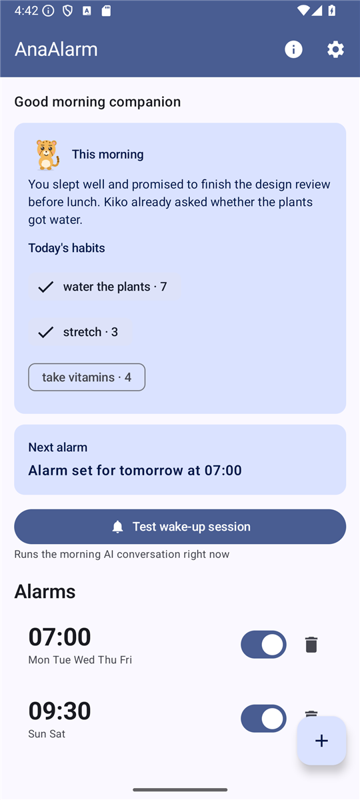
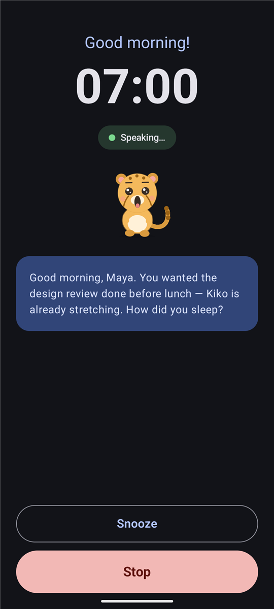
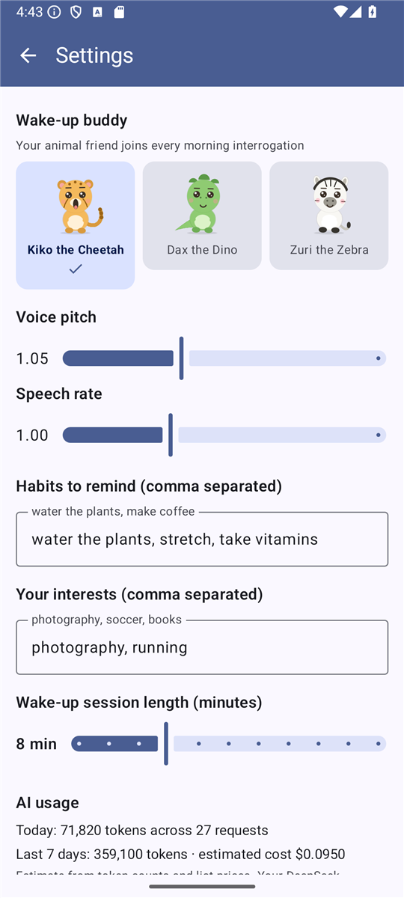
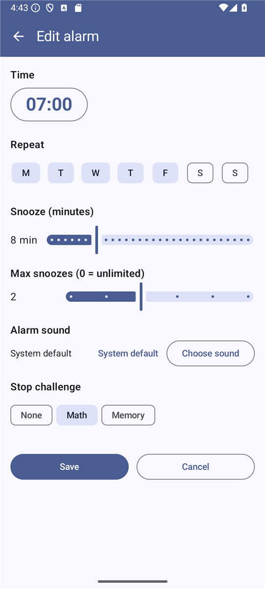

# AnaAlarm — the alarm clock that talks you awake

<p align="center">
  <em>A native Android alarm clock that replaces the buzzer with a real spoken conversation.</em><br>
  <strong>Kotlin · Jetpack Compose · Room · DeepSeek-V4-Flash · English + Português (BR)</strong>
</p>

---

## Table of contents

1. [What this is](#1-what-this-is)
2. [Why it exists](#2-why-it-exists)
3. [Feature tour](#3-feature-tour)
4. [How it works under the hood](#4-how-it-works-under-the-hood)
5. [Tech stack](#5-tech-stack)
6. [Repository layout](#6-repository-layout)
7. [Prerequisites](#7-prerequisites)
8. [Build](#8-build)
9. [Deploy](#9-deploy)
10. [First run and configuration](#10-first-run-and-configuration)
11. [Using the app](#11-using-the-app)
12. [Testing](#12-testing)
13. [Permissions explained](#13-permissions-explained)
14. [Privacy and data](#14-privacy-and-data)
15. [Cost of running it](#15-cost-of-running-it)
16. [Troubleshooting quick reference](#16-troubleshooting-quick-reference)
17. [Known limitations](#17-known-limitations)
18. [Extending the app](#18-extending-the-app)
19. [Documentation index](#19-documentation-index)
20. [License](#20-license)

---

## 1. What this is

AnaAlarm is a standalone Android alarm clock. You set alarms exactly like you would in any
other clock app — a time, some repeat days, a snooze length. The difference is what happens
when the alarm goes off.

A local ringtone/vibration starts first, then a full-screen wake-up session opens over the lock
screen and **Ana**, an AI companion powered by DeepSeek-V4-Flash, starts talking to you out loud:

- She greets you by name and asks how you slept.
- She runs quick quizzes and memory games so your brain has to actually switch on.
- She asks what you are planning to do today, and remembers the answer.
- She nudges you about the habits you configured ("Did you water the plants?").
- She follows up on what you said the previous morning ("You said you'd call your mom — did you?").
- After a configurable 5–15 minutes she wraps up with an energetic "time to get up!".

You answer by speaking. Android speech recognition prefers an on-device engine where available,
but its default fallback may use the device vendor's network service. The transcript is sent to
the model with conversation history, and the reply is spoken through text-to-speech. If the
microphone or recognizer is unavailable, the same conversation continues through a text box.

Everything is fully localized in **English** and **Brazilian Portuguese** — the interface, the
speech synthesis voice, the recognition language and the language Ana replies in.

## 2. Why it exists

A ringtone trains you to develop a reflex: hear noise, hit snooze, stay asleep. A conversation
does not work that way. Answering questions out loud, doing arithmetic and recalling an earlier
promise requires you to actually be awake, and by the time the session ends you are.

The follow-up memory is the part that makes it feel personal rather than gimmicky. A bounded,
role-labelled session transcript is appended to a daily log, and a later morning's system prompt
includes the most recent prior-day log so Ana can carry a thread forward.

<p align="center">
  
  
  
</p>

A longer walkthrough with every major screen is in [docs/PRODUCT_TOUR.md](docs/PRODUCT_TOUR.md).

## 3. Feature tour

### Alarms
| Capability | Detail |
|---|---|
| Exact alarms | Scheduled through `AlarmManager.setAlarmClock()`, the strongest alarm API: it survives Doze, is exempt from idle batching, and shows up in the system's "next alarm" affordance |
| Repeat days | Any combination of weekdays, stored as a 7-bit mask (bit 0 = Sunday … bit 6 = Saturday) |
| Snooze | 1–30 minutes per alarm, exposed as a real action on alarm-started wake-up sessions; an optional per-alarm cap (0–5) survives reboots and pre-unlock snoozes |
| Stop challenge | Optional per-alarm proof-of-wakefulness before Stop works: a mental-math question or a memorized 4-digit code, generated locally with zero API cost |
| Custom sound | Per-alarm alarm tone via the system ringtone picker; falls back to the system default (and to the immediate generated tone) whenever it cannot be resolved |
| Morning recap | The home screen shows what you said this morning plus a tappable habit checklist with live streaks; active streaks are celebrated inside the next wake-up prompt |
| Statistics | A local stats screen shows sessions this week, average duration, recent sessions, and 7-day token usage — all from the on-device ledger |
| Home-screen widget | A compact next-alarm widget (framework RemoteViews) that always mirrors the system's registered next alarm |
| Enable/disable | Per-alarm switch; disabling cancels the pending system alarm immediately |
| Boot and clock-change survival | A minimal device-protected alarm mirror re-arms enabled alarms at locked boot without opening Room, DataStore, credentials, voice, or AI; it reconciles with Room after unlock and also handles app updates, time/time-zone changes, and exact-alarm permission grants |
| Full-screen wake | A foreground service posts a full-screen-intent notification and launches the wake-up activity over the lock screen |
| Offline fallback | Local alarm audio and vibration start immediately and continue until TTS actually begins or the user stops/snoozes; no key, network, ASR, or TTS is required to wake the user |

### The wake-up session
| Capability | Detail |
|---|---|
| Spoken conversation | Android TTS out, Android `SpeechRecognizer` in, alternating spoken turn-taking managed by `SessionController` |
| Typing fallback | Appears automatically when there is no recognizer, the mic permission is missing, or two listening cycles pass in silence — and is always reachable via "Type instead" |
| Live clock | Large clock plus a colour-coded status pill: Starting / Speaking / Listening / Thinking / Ended |
| Stop conditions | A stop phrase ("stop", "I'm up", "acordei", "pode parar", …), the session timer expiring, the Stop button, or an unrecoverable AI error; on AI error the independent alarm keeps ringing until Stop/Snooze |
| Graceful failure | Missing key, rejected key, TLS interception and network loss each produce a specific, actionable on-screen message instead of a crash |
| Memory | The last 20 message rows are re-sent with each request; up to 900 characters of raw role-labelled history are appended to the dated daily log at the end |

### Personalisation
| Setting | What it changes |
|---|---|
| DeepSeek API key | Required for conversation. Encrypted with an Android Keystore AES-GCM key, masked in the UI, and trimmed/BOM-stripped on paste |
| Your name | Ana addresses you by it |
| Language | TTS voice, recognition language, and the language directive in the system prompt |
| Habits | Comma-separated; Ana asks about them naturally during the session |
| Interests | Comma-separated; Ana brings them up as conversation topics |
| Session length | 5–15 minutes before she wraps up |
| Tone & voice | Gentle / cheerful / drill-sergeant energy plus voice pitch and speech-rate sliders |
| Wake-up buddy | Animated animal (Kiko the cheetah, Dax the dino, or Zuri the zebra) on the wake-up screen, stop-challenge dialog, home recap, and in Ana's prompt |
| Data export | One-tap encrypted export/import of logs, habits, sessions, and preferences (never the API key) |

## 4. How it works under the hood

```
      alarm time
          │
          ▼
  AlarmManager.setAlarmClock ──► AlarmReceiver (BroadcastReceiver)
          │                            │
          │                            ├─► AlarmService (foreground, systemExempted)
          │                            │      ├─ local alarm sound + vibration
          │                            │      ├─ silent foreground notification + screen wake
          │                            │      └─ PendingIntent.send() ──► WakeUpActivity
          │                            │            (falls back to a ringing
          │                            │             full-screen-intent alert)
          │                            └─► disable one-shot or re-arm repeating occurrence
          ▼
    WakeUpActivity (show-when-locked, adaptive, own task)
          │
          ▼
    SessionController ── state machine ──────────────────────────────┐
          │                                                          │
          ├─ TTS warm-up ────────────────┐                           │
          ├─ ConversationEngine.startSession() (in parallel)         │
          │     ├─ PromptBuilder: persona + profile + date +         │
          │     │                 most recent prior-day log          │
          │     └─ POST https://api.deepseek.com/responses           │
          │                                                          │
          ├─ TtsManager.speak(reply) ─► audio start stops alarm      │
          │                             └► completion ─► listen      │
          ├─ SpeechListener.startListening(lang) ─► transcript ──────┘
          │
          └─ end ─► ConversationEngine.endSession()
                       └─ MemoryStore.saveDailyLog(transcript) ──► Room
```

Three details worth knowing:

- **The foreground notification is silent, but the alarm is not.** A service-owned local alarm
  tone and vibration begin without waiting for the network. They stop only when TTS reports real
  audio start, or when the user explicitly stops or snoozes.
- **The DeepSeek Responses API is stateless here.** `previous_response_id` / `conversation` are
  not used, so conversation memory is entirely client-side: history is re-sent on every call.
- **TTS completion drives the state machine.** Some engines drop utterance callbacks, so
  `TtsManager` runs a watchdog that force-completes an utterance rather than letting a session
  hang forever.

See [docs/ARCHITECTURE.md](docs/ARCHITECTURE.md) for the full module breakdown, thread model and
data model.

## 5. Tech stack

| Area | Choice |
|---|---|
| Language | Kotlin 2.1.0 |
| UI | Jetpack Compose, Material 3 (Compose BOM 2024.12.01) |
| Architecture | MVVM where state is shared, direct state elsewhere; single activity for the app shell plus a dedicated full-screen alarm activity; manual DI in `Application` |
| Persistence | Room 2.6.1 (alarms, messages, daily logs) + DataStore Preferences (settings) |
| Networking | Retrofit 2.11.0, OkHttp 4.12.0, `converter-kotlinx-serialization`, kotlinx-serialization-json 1.7.3 |
| Concurrency | Kotlin Coroutines 1.9.0 (Flow, `stateIn`, structured scopes) |
| AI | DeepSeek `deepseek-v4-flash` via the Responses API |
| Voice | Android `TextToSpeech` and `SpeechRecognizer` (no third-party SDKs) |
| Build | Gradle 8.11.1, AGP 8.9.1, KSP 2.1.0-1.0.29, JDK 17 bytecode |
| SDK levels | `minSdk` 26 (Android 8.0) · `targetSdk`/`compileSdk` 36 (Android 16) |
| Tests | JUnit4, MockK, Robolectric, MockWebServer, Espresso, Compose UI Test, UI Automator |

## 6. Repository layout

```
AnaAlarm/
├── build.gradle.kts              # Plugin versions (AGP, Kotlin, KSP, serialization)
├── settings.gradle.kts           # Repositories and module list
├── gradle.properties             # JVM args, AndroidX flags, test-platform switches
├── gradlew / gradlew.bat         # Gradle wrapper (no global Gradle needed)
├── local.properties              # sdk.dir — machine specific, NOT committed
├── .github/workflows/android.yml # GitHub Actions CI/signing mirror (not Origin-native)
├── CONTRIBUTING.md               # Origin-primary remotes, Windows/WSL Origin, CI mirror push
├── scripts/
│   ├── push-ci-mirror.ps1          # Push HEAD to the GitHub Actions/signing mirror
│   ├── run-instrumented-tests.ps1  # One-command Windows on-device test run
│   └── ci/                         # Device, release-smoke, and internal APK verification helpers
├── docs/                         # Architecture, AI, alarms, localization, testing, troubleshooting
└── app/
    ├── build.gradle.kts          # Module config and dependencies
    └── src/
        ├── main/
        │   ├── AndroidManifest.xml
        │   ├── res/
        │   │   ├── values/          # English strings, colors, themes
        │   │   ├── values-pt-rBR/   # Brazilian Portuguese strings
        │   │   ├── drawable/        # Vector icons
        │   │   └── xml/             # Network security config
        │   └── java/com/anaalarm/
        │       ├── AnaAlarmApp.kt   # Application: manual DI container
        │       ├── MainActivity.kt  # Entry point, runtime permissions
        │       ├── ai/              # DeepSeek client, prompt builder, engine, error mapping
        │       ├── alarm/           # Scheduler, receivers, foreground service, notifications
        │       ├── data/            # Room entities/DAOs/database, SettingsStore, MemoryStore
        │       ├── ui/              # Compose screens, theme, wake-up session, avatar rig
        │       └── voice/           # TTS manager, speech recognition wrapper
        ├── debug/res/xml/        # Debug-only network config (loopback cleartext for tests)
        ├── test/                 # Fast JVM unit tests
        └── androidTest/          # Real Android/Room/Keystore/alarm/voice tests
```

## 7. Prerequisites

| Requirement | Notes |
|---|---|
| **JDK 17 or 21** | Verified on Temurin/Oracle 21. `java -version` must work from your shell |
| **Android SDK, platform 36** | Install via Android Studio's SDK Manager, or `sdkmanager "platforms;android-36" "platform-tools"` |
| **Gradle** | Not needed globally — the wrapper (`gradlew.bat` / `gradlew`) downloads 8.11.1 |
| **A device or emulator** | Android 8.0+. A physical phone is strongly recommended for voice; emulators vary in microphone and TTS support |
| **A DeepSeek API key** | Free to create at [platform.deepseek.com/api_keys](https://platform.deepseek.com/api_keys). Required for conversations; everything else works without one |
| **Google speech services** | Needed for on-device speech recognition. Without it the app automatically falls back to typed answers |

Point the build at your SDK either with an environment variable:

```powershell
setx ANDROID_HOME "C:\Users\<you>\AppData\Local\Android\Sdk"
```

…or by creating `local.properties` in the project root:

```properties
sdk.dir=C\:\\Users\\<you>\\AppData\\Local\\Android\\Sdk
```

`local.properties` is machine-specific and intentionally git-ignored.

## 8. Build

### Clone

**Cursor Origin is the source of truth.** GitHub is the CI and signing mirror.
The Origin CLI is not supported on native Windows — use WSL. See
[CONTRIBUTING.md](CONTRIBUTING.md) for remotes, `origin auth login`, and
`.\scripts\push-ci-mirror.ps1`.

Clone from Origin (WSL after `origin auth login`):

```bash
origin repo clone acidburn/AnaAlarm
cd AnaAlarm
git remote add github https://github.com/burnigtm/AnaAlarm.git
```

Equivalent git URL: `https://origin.cursor.com/acidburn/AnaAlarm.git`.
Repo page: https://cursor.com/codebase/acidburn/AnaAlarm.
GitHub (`https://github.com/burnigtm/AnaAlarm.git`) is only the CI/signing
mirror — add it as the `github` remote, not as `origin`.

### Debug build

```powershell
# Windows
.\gradlew.bat assembleDebug

# macOS / Linux
./gradlew assembleDebug
```

Output: `app/build/outputs/apk/debug/app-debug.apk`

The first build downloads roughly a gigabyte of dependencies and can take several minutes.
Everything after that is incremental.

### Clean build

```powershell
.\gradlew.bat clean assembleDebug
```

### Release build (unsigned)

```powershell
.\gradlew.bat assembleRelease
```

Output: `app/build/outputs/apk/release/app-release-unsigned.apk`

### Ready-to-install CI build

Successful trusted `main` runs **on the GitHub CI mirror** can publish a signed, minified
**AnaAlarm Internal** APK after the Host, API 26, and API 36 checks all pass and the signing
environment's approval gate is satisfied. Origin-only pushes do not produce that artifact.
It uses the separate package `com.anaalarm.internal`, so it can coexist with a production
installation. See
[CI and installable APK builds](docs/CI_AND_INSTALLABLE_BUILDS.md) for download, checksum,
installation, update, retention, and signing-key details.

### Android App Bundle (for the Play Store)

```powershell
.\gradlew.bat bundleRelease
```

Output: `app/build/outputs/bundle/release/app-release.aab`

### Useful build tasks

| Command | Purpose |
|---|---|
| `.\gradlew.bat tasks` | List every available task |
| `.\gradlew.bat :app:dependencies` | Full dependency tree |
| `.\gradlew.bat lint` | Android Lint report at `app/build/reports/lint-results-debug.html` |
| `.\gradlew.bat --stop` | Kill stale Gradle daemons |
| `.\gradlew.bat assembleDebug --refresh-dependencies` | Re-resolve after a broken download |

> **Behind a TLS-inspecting antivirus or corporate proxy?** Configure build tooling and debug
> devices explicitly. Release API traffic trusts system CAs only; exempt `api.deepseek.com` or use
> a non-intercepted network. No build disables certificate or hostname verification.

## 9. Deploy

### A. Install a debug build on a connected device

1. Enable **Developer options** on the phone (tap *Build number* seven times in
   Settings → About phone) and turn on **USB debugging**.
2. Connect over USB and accept the RSA fingerprint prompt.
3. Verify the device is visible:

   ```powershell
   adb devices
   ```

4. Build and install in one step:

   ```powershell
   .\gradlew.bat installDebug
   ```

   or install an already-built APK:

   ```powershell
   adb install -r app\build\outputs\apk\debug\app-debug.apk
   ```

From Android Studio, simply open the project folder and press **Run** — the same thing happens.

### B. Install over Wi-Fi (Android 11+)

```powershell
adb pair <phone-ip>:<pairing-port>     # code shown under Wireless debugging
adb connect <phone-ip>:5555
.\gradlew.bat installDebug
```

### C. Ship a signed release

1. **Create a keystore once** (keep it somewhere safe and out of the repository):

   ```powershell
   keytool -genkey -v -keystore anaalarm-release.jks -alias anaalarm `
           -keyalg RSA -keysize 2048 -validity 10000
   ```

2. **Create `keystore.properties`** in the project root (git-ignored):

   ```properties
   storeFile=C:/keys/anaalarm-release.jks
   storePassword=********
   keyAlias=anaalarm
   keyPassword=********
   ```

3. **Wire it into `app/build.gradle.kts`:**

   ```kotlin
   val keystoreProperties = java.util.Properties().apply {
       val file = rootProject.file("keystore.properties")
       if (file.exists()) load(file.inputStream())
   }

   android {
       signingConfigs {
           create("release") {
               storeFile = file(keystoreProperties.getProperty("storeFile"))
               storePassword = keystoreProperties.getProperty("storePassword")
               keyAlias = keystoreProperties.getProperty("keyAlias")
               keyPassword = keystoreProperties.getProperty("keyPassword")
           }
       }
       buildTypes {
           release {
               signingConfig = signingConfigs.getByName("release")
               isMinifyEnabled = true
               proguardFiles(
                   getDefaultProguardFile("proguard-android-optimize.txt"),
                   "proguard-rules.pro"
               )
           }
       }
   }
   ```

4. **Build and verify:**

   ```powershell
   .\gradlew.bat bundleRelease
   # or, for direct distribution:
   .\gradlew.bat assembleRelease
   apksigner verify --print-certs app\build\outputs\apk\release\app-release.apk
   ```

5. **Bump the version** in `app/build.gradle.kts` before every upload — Play rejects a
   `versionCode` it has already seen:

   ```kotlin
   versionCode = 2
   versionName = "1.1"
   ```

> Release minification is enabled. Keep the kotlinx-serialization and Retrofit rules in
> `app/proguard-rules.pro`, and run a signed-release smoke test before shipping.

### D. Play Store notes (out of scope)

Google Play publishing is **not a current project goal**. `versionCode` is `1`, CI does not
build an AAB, and [docs/PLAY_RELEASE_CHECKLIST.md](docs/PLAY_RELEASE_CHECKLIST.md) is parked
until an owner explicitly revives it. The notes below are retained only so a future Play
attempt does not start from zero.

- **Alarm apps get privileged permissions, but you must justify them.** `SCHEDULE_EXACT_ALARM`
  and `USE_FULL_SCREEN_INTENT` both require a declaration in the Play Console explaining that
  this is an alarm clock. That is an accepted use case, but the form is mandatory.
- **`FOREGROUND_SERVICE_SYSTEM_EXEMPTED`** is used because the service continues a user-scheduled
  exact alarm with sound/haptics. The app must actually retain exact-alarm access, and the FGS
  use plus demonstration video must still be declared in Play Console.
- **Users supply their own API key**, so there is no server-side component to host and no
  backend cost. Mention this in the store listing so the key prompt is not a surprise.
- Fill in the **Data safety** form honestly: conversation text leaves the device and is sent to
  DeepSeek. See [Privacy and data](#14-privacy-and-data).

### E. Distributing without the Play Store

`assembleRelease` produces an unsigned release APK unless you supply the signing configuration
described above. Sign it before hosting it anywhere. Users must enable "Install unknown apps"
for their browser or file manager. Keep each package's signing key stable and backed up - Android
refuses to update an app whose signature changed.

For tester convenience, the **GitHub Actions** workflow on the CI mirror also publishes a
separately signed `com.anaalarm.internal` APK. Origin pushes do not run that job until the
same commit is pushed to GitHub (`.\scripts\push-ci-mirror.ps1`). Its internal key must never
be used for the production package or Google Play. See
[docs/CI_AND_INSTALLABLE_BUILDS.md](docs/CI_AND_INSTALLABLE_BUILDS.md).

Play Store listing, Console declarations, and a production AAB are **out of scope** for
current development (`versionCode` remains `1`). See
[docs/PLAY_RELEASE_CHECKLIST.md](docs/PLAY_RELEASE_CHECKLIST.md).

## 10. First run and configuration

1. Launch **AnaAlarm**. It immediately asks for **notifications** (Android 13+) and the
   **microphone**. Both are needed for the full experience; the app degrades gracefully without
   the mic.
2. If the home screen shows an **exact alarm permission** warning card, tap **Grant permission**
   and allow it in the system dialog (Android 12+). Without it, AnaAlarm refuses to claim that an
   alarm was scheduled and shows an actionable error.
3. If a **full-screen alarm permission** card appears (Android 14+), grant that too — it is what
   allows the wake-up screen to appear over the lock screen instead of a passive notification.
4. Open **Settings** (gear icon, top right) and fill in:
   - **DeepSeek API key** — paste it from
     [platform.deepseek.com/api_keys](https://platform.deepseek.com/api_keys). Leading/trailing
     whitespace and invisible BOM characters from browser copy-paste are stripped automatically.
   - **Your name** — Ana uses it in conversation.
   - **Language** — English or Português.
   - **Habits** — comma-separated, e.g. `water the plants, take vitamins, stretch`.
   - **Interests** — comma-separated, e.g. `photography, football, science fiction`.
   - **Session length** — 5 to 15 minutes.
5. Tap **Save**. A "Settings saved" confirmation appears.
6. Go back and tap **Test wake-up session** to hear Ana greet you right away — the fastest way to
   confirm the API key, the TTS voice and the microphone all work before you rely on it tomorrow
   morning.

## 11. Using the app

Screenshot walkthrough: [docs/PRODUCT_TOUR.md](docs/PRODUCT_TOUR.md).

### Creating an alarm
1. Tap the **+** button.
2. Tap the time to open the time picker.
3. Tap the day chips to choose repeat days. Selecting none creates a one-shot alarm.
4. Drag the snooze slider (1–30 minutes).
5. Tap **Save**. A confirmation tells you exactly when it will fire — "today at 06:30",
   "tomorrow at 06:30" or "Sat at 06:30". Optional **Stop challenge** (math or a memorized code)
   is on the same editor.



### Managing alarms
- **Edit:** tap the alarm card; every field is pre-filled.
- **Enable/disable:** use the switch on the card. Disabled cards are dimmed and their system
  alarm is cancelled.
- **Delete:** tap the trash icon and confirm in the dialog.

### During a wake-up session
1. The screen turns on, shows over the keyguard, requests dismissal where the system permits,
   and displays a large live clock.
2. Ana speaks the greeting; the status pill reads **Speaking…**.
3. When she finishes, the pill switches to **Listening…** — answer out loud, normally.
4. Your transcript appears under "You said", the pill shows **Thinking…**, then she replies.
5. To end early, say a **stop phrase** or press the big red **Stop** button.

   | Language | Phrases that end the session |
   |---|---|
   | English | stop · I'm up · I am up · time to get up · get up · done · bye · goodbye |
   | Português | para · chega · acordei · levantei · estou de pé · de pé · pode parar |

6. If she cannot hear you twice in a row, or the device has no speech recognizer, a text box
   appears. Type your answer and press **Send** — the conversation continues identically. You can
   also switch to typing at any time with **Type instead**.
7. When the session ends, a bounded role-labelled transcript is appended to today's log, and
   tomorrow morning Ana can refer back to it. The home recap card shows that summary next to
   your buddy, with today's habits as a tappable checklist.


### Everyday tips
- Set the session length to 5 minutes on weekdays; you can always keep talking past the
  greeting, and she wraps up on her own.
- Habits work best as short imperative phrases: `water the plants` beats
  `remember to water all of the plants in the living room`.
- The **Test wake-up session** button consumes API credit exactly like a real alarm does.

## 12. Testing

The project ships two complete suites: fast JVM unit tests and full on-device instrumented
coverage.

| Suite | Location | Count | Runtime | What it proves |
|---|---|---|---|---|
| JVM unit tests | `app/src/test` | See the generated Gradle report | seconds | Trigger/snooze/direct-boot logic, LLM deadlines and cancellation, migrations/retention, settings, view-models, telemetry, and stale voice-callback rejection |
| Instrumented tests | `app/src/androidTest` | See the device-reported verdict | ~3 minutes per API | Real Room migrations/retention, Keystore recovery, AlarmManager, receivers/service, Compose, TTS, recognition, and the real HTTP stack against a local fake |

### Running the unit tests

```powershell
.\gradlew.bat test
# HTML report: app/build/reports/tests/testDebugUnitTest/index.html
```

### Running the instrumented tests

Start an emulator or connect a device, then:

```powershell
.\scripts\run-instrumented-tests.ps1
```

The script builds and installs both APKs, grants the runtime permissions and app-ops the suite
needs, disables animations, runs the whole suite through `adb shell am instrument`, and prints a
one-line verdict. To iterate on a single class or test:

```powershell
.\scripts\run-instrumented-tests.ps1 -Filter com.anaalarm.ui.HomeScreenInstrumentedTest
.\scripts\run-instrumented-tests.ps1 -Filter com.anaalarm.ui.HomeScreenInstrumentedTest#emptyStateExplainsWhatToDoNext
.\scripts\run-instrumented-tests.ps1 -SkipBuild   # reuse the installed APKs
```

> The script drives `am instrument` directly, which gives predictable device output and avoids
> host-specific result-streaming failures.

No API key or internet access is required: the instrumented suite runs a MockWebServer inside
the app process and swaps the AI backend at runtime, so real conversations are exercised against
a local fake. A debug-only network security config permits cleartext to loopback for exactly
this purpose; the release configuration is unchanged.

Full breakdown of what each class covers, plus the manual QA checklist for the things a machine
cannot verify (does the phone actually wake you up?), is in [docs/TESTING.md](docs/TESTING.md).

## 13. Permissions explained

| Permission | Why it is needed | Consequence if denied |
|---|---|---|
| `INTERNET` | Talking to the DeepSeek API | No conversation at all |
| `RECORD_AUDIO` | Speech recognition during a session | Session falls back to typed answers |
| `SCHEDULE_EXACT_ALARM` | Firing at the exact minute you set | Save reports failure and the alarm is not registered until permission is granted |
| `USE_FULL_SCREEN_INTENT` | Showing the wake-up screen over the lock screen | Only a heads-up notification appears |
| `POST_NOTIFICATIONS` | The alarm notification carries the full-screen intent | Notification/full-screen surfacing is degraded on Android 13+; service-owned sound and vibration can still continue |
| `RECEIVE_BOOT_COMPLETED` | Re-arming alarms after a reboot | Alarms are lost on restart |
| `WAKE_LOCK` | Turning the screen on when the alarm fires | Screen may stay off |
| `VIBRATE` | Vibration on the alarm channel | Vibration is unavailable; local sound still plays |
| `FOREGROUND_SERVICE` + `FOREGROUND_SERVICE_SYSTEM_EXEMPTED` | Exact-alarm continuation with local sound/haptics and wake UI | The alarm cannot reliably continue from the background |

## 14. Privacy and data

- **Everything is stored locally.** Alarms, transient conversation messages and daily logs live
  in Room (`anaalarm.db`); settings live in DataStore. App backup is disabled and both stores are
  explicitly excluded from cloud backup and device transfer.
- **What leaves the device:** the system prompt (your name, habits, interests, the most recent
  prior-day log) and the current conversation turns are sent to `api.deepseek.com` over HTTPS on
  each turn. Voice audio itself never reaches DeepSeek — transcription happens through Android's
  own speech recognizer, which may itself be a Google cloud service depending on the device.
- **The API key** is encrypted with AES-GCM using an app-private Android Keystore key before its
  ciphertext is written to DataStore. Legacy plaintext values are migrated in place and removed.
  Logs report only whether a key is set and its length—never key characters.
- **Raw transcript retention is bounded.** After a bounded role-labelled transcript is appended
  to the daily log, its transient message rows are deleted. Abandoned/failed rows are pruned after
  seven days; dated daily logs remain for follow-up context.
- **Uninstalling the app deletes all of it.** There is no cloud account and no sync.

## 15. Cost of running it

You pay DeepSeek directly for your own key. A 10-minute session is roughly 15–25 API calls, each
carrying a system prompt of a few hundred tokens plus recent history, with reasoning disabled and
output capped at 96 tokens. On `deepseek-v4-flash` pricing that is a small amount per morning, but it is
not zero — check current rates on the DeepSeek pricing page, and note that a longer session
length means proportionally more calls.

## 16. Troubleshooting quick reference

| Symptom | Most likely cause | Fix |
|---|---|---|
| Alarm never rings | Exact-alarm permission not granted | Grant it from the home-screen warning card; verify with `adb shell cmd appops get com.anaalarm SCHEDULE_EXACT_ALARM` |
| Notification appears but no full-screen UI | Full-screen intent restricted by the OEM | Settings → Apps → AnaAlarm → Alarms & reminders → Full screen |
| Alarm stops working after a few days | OEM battery killer | Add AnaAlarm to the "no restrictions" / autostart allow-list (common on Xiaomi, Huawei, Samsung) |
| "No API key configured" | Key not saved | Settings → paste the key → Save |
| "DeepSeek rejected the API key" | Wrong or revoked key | Regenerate at platform.deepseek.com |
| "Secure connection failed" | HTTPS interception | Exempt `api.deepseek.com`, disable inspection, or use a network without interception |
| Ana is silent | No TTS voice for the selected language | Install the voice under Settings → Accessibility → Text-to-speech output |
| She never hears you | No Google speech services, or mic denied | Grant the mic, or just use the typing fallback |
| She "forgets" prior context | The previous session ended by force-kill, so no log was written | End sessions with Stop, a stop phrase, or the timer |

Longer explanations for each of these: [docs/TROUBLESHOOTING.md](docs/TROUBLESHOOTING.md).

## 17. Known limitations

- **The DeepSeek Responses API is used statelessly.** `previous_response_id` and `conversation`
  are not supported in this integration, so the last 20 messages are re-sent on every turn. Long
  sessions therefore cost more per turn than a server-side-threaded API would.
- **Google Play publishing is out of scope.** `versionCode` is `1`; the Play checklist is a
  future owner task, not a current release path.
- **The in-app language setting localizes the interface on Android 13+.** It always drives the
  TTS voice, the recognition language and the language Ana replies in; from Android 13 the UI
  itself follows it too via per-app locales. On older versions the UI follows the device
  language, using `values/` and `values-pt-rBR/`.
- **Speech recognition depends on Google services.** Devices without them fall back to typing.
- **Full-screen intents are OEM-dependent.** Some manufacturers restrict them regardless of the
  granted permission; the ringing-notification fallback exists for exactly this case.
- **Streaming speech ships behind a disabled-by-default flag.** The Responses SSE transport,
  phrase segmenter, and QUEUE_ADD phrase queue are implemented and fixture-tested
  (`streamingEnabled` setting); the default path remains bounded complete responses. The design
  contract is specified in
  [docs/RELIABILITY_AND_LATENCY.md](docs/RELIABILITY_AND_LATENCY.md#responses-streaming-and-phrase-level-tts-overlap).
- **In-app usage display is an estimate.** Settings shows tokens and an estimated cost computed
  from provider-reported token counts and list prices; your DeepSeek dashboard always shows the
  exact billed amount.
- **Single user, single device.** No accounts, no sync, no backup/restore of conversation history.

## 18. Extending the app

| You want to… | Start here |
|---|---|
| Add a language | `docs/LOCALIZATION.md` — add `values-<locale>/strings.xml`, extend the language chips in `SettingsScreen`, map the locale in `TtsManager.setLanguage`, and add the directive in `PromptBuilder` |
| Swap the AI provider | Implement a client with the same shape as `DeepSeekClient.respond(instructions, history)` and hand it to `ConversationEngine`; `AnaAlarmApp.overrideAiBackend` already exists as the injection point |
| Change Ana's personality | `PromptBuilder.buildInstructions` — the entire persona and session script is one readable prompt |
| Add stop phrases | `SessionPhrases.stopPhrases` |
| Tune session pacing | `SessionController`: `LISTEN_TIMEOUT_MS`, `MAX_SILENT_CYCLES`, and the post-speech settle delay |
| Tune alarm/snooze behavior | `AlarmScheduler`, `AlarmReceiver`, and `SessionController.snoozeNow()` |
| Change credential storage | `SettingsStore` and `KeystoreSecretCipher` |

## 19. Documentation index

| Document | Contents |
|---|---|
| [docs/ARCHITECTURE.md](docs/ARCHITECTURE.md) | Module map, thread model, session lifecycle, data model, error strategy |
| [docs/PRODUCT_TOUR.md](docs/PRODUCT_TOUR.md) | Annotated screenshots of home, settings, the wake-up session, stop challenges, and stats |
| [docs/ENHANCEMENTS.md](docs/ENHANCEMENTS.md) | The 2026 enhancement program: streaming, usage dashboard, persona, challenges, habits, widget, export |
| [docs/AI_INTEGRATION.md](docs/AI_INTEGRATION.md) | Responses API usage, prompt design, memory model, token/cost behaviour |
| [docs/ALARM_SYSTEM.md](docs/ALARM_SYSTEM.md) | Scheduling, permissions, receivers, per-Android-version caveats |
| [docs/LOCALIZATION.md](docs/LOCALIZATION.md) | How languages work and how to add one |
| [docs/TESTING.md](docs/TESTING.md) | Automated suites, how to run them, and the manual QA checklist |
| [CONTRIBUTING.md](CONTRIBUTING.md) | Origin-primary remotes, GitHub CI mirror, Windows/WSL Origin CLI |
| [docs/CI_AND_INSTALLABLE_BUILDS.md](docs/CI_AND_INSTALLABLE_BUILDS.md) | GitHub Actions gates, APK download, signing, mirroring from Origin |
| [docs/TROUBLESHOOTING.md](docs/TROUBLESHOOTING.md) | Symptom-by-symptom fixes |
| [docs/RELEASE_GATE_VALIDATION.md](docs/RELEASE_GATE_VALIDATION.md) | Physical-device runbook + evidence tooling for issue #6's release gates |
| [docs/RELIABILITY_AND_LATENCY.md](docs/RELIABILITY_AND_LATENCY.md) | Reliability invariants, latency budget, telemetry, and deferred streaming work |
| [docs/SUPPLY_CHAIN.md](docs/SUPPLY_CHAIN.md) | Strict dependency verification/locking and pinned CI-action maintenance |
| [docs/PLAY_RELEASE_CHECKLIST.md](docs/PLAY_RELEASE_CHECKLIST.md) | Physical-device release matrix and Play foreground/full-screen declarations |

## 20. License

Personal project. No license file is included, which means all rights are reserved by default —
please ask the owner before redistributing or publishing a derivative.
