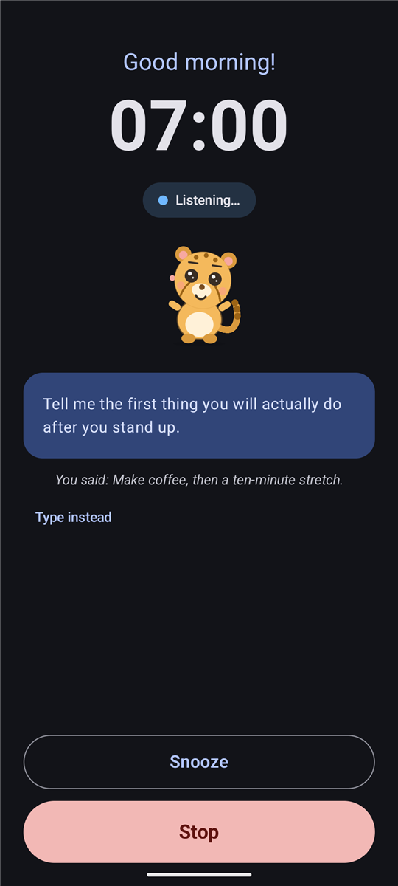
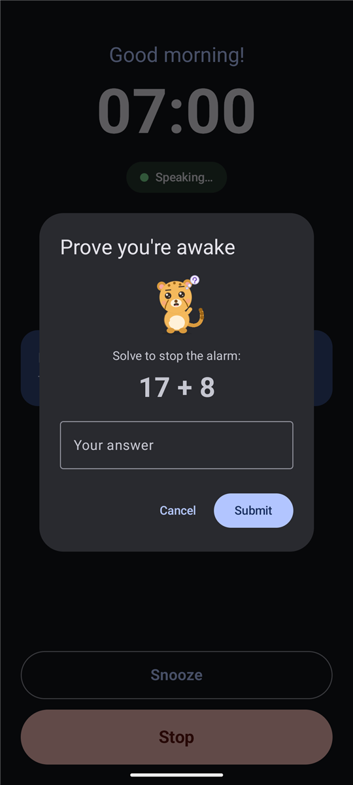
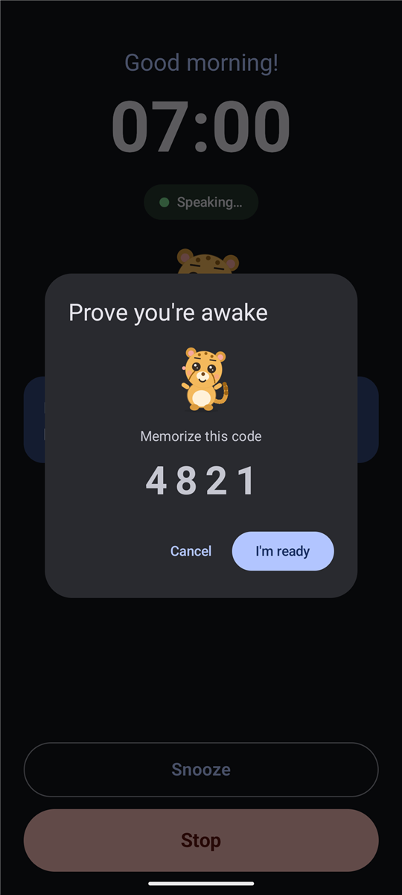
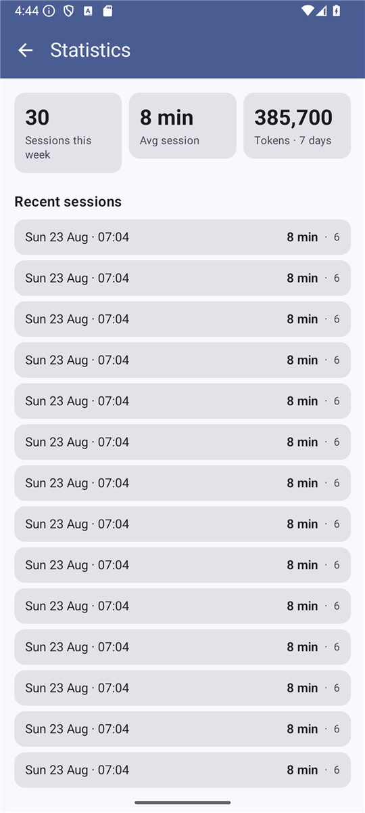

# Product tour

These screenshots are captured from the debug build on an Android emulator. They show the
real product screens, not mockups: the same Compose UI a user sees on a weekday morning.

Regenerate them after a UI change with a booted emulator:

```powershell
.\gradlew.bat :app:installDebug
.\scripts\capture-docs-screenshots.ps1
```

The capture script launches a debug-only gallery activity (`DocsGalleryActivity`). That
activity is not in release builds.

---

## Home after a session

The recap card is Kiko's corner of the house: this morning's durable summary, a tappable habit
checklist with live streaks, the next alarm, and the list of enabled clocks.


## Choosing a wake-up buddy

Settings keeps the three species side by side as live previews. Kiko the cheetah is selected
here; Dax the dino and Zuri the zebra are one tap away. Pitch, rate, habits, interests, and
session length sit on the same page so the buddy is part of the persona, not a separate toy.


## Editing an alarm with a stop challenge

Time, repeat days, snooze length, a snooze cap, the system sound, and the stop challenge
(None / Math / Memory) live on one editor. Math is selected on this weekday 07:00 alarm.


## A speaking wake-up

The full-screen session is dark on purpose: large clock, status pill, the buddy reacting while
Ana talks, the spoken line, then Snooze and Stop pinned at the bottom so they stay reachable
over a long reply.


## Listening for the answer

When the pill switches to Listening, the buddy leans in. The transcript of what you just said
appears under Ana's prompt; **Type instead** is there if the room is noisy.



## Math stop challenge

Stop on a challenged alarm opens a local puzzle. The buddy thinks along; Snooze and Stop stay
on the session behind the dialog. No API call is involved.



## Memory stop challenge

The memory variant shows a four-digit code first. **I'm ready** hides it and asks you to type
it back. The buddy stays in the dialog the whole time.



## Weekly statistics

Sessions this week, average duration, and seven-day token use come from the on-device ledger.
Nothing here is fetched from the network.


